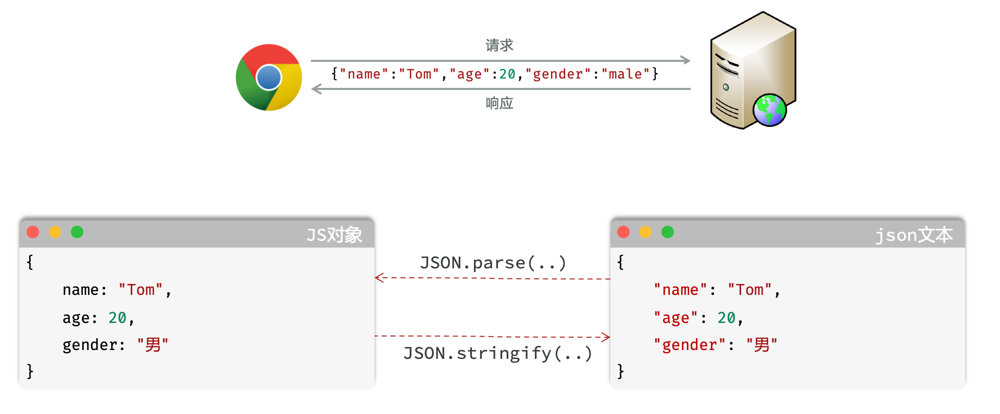
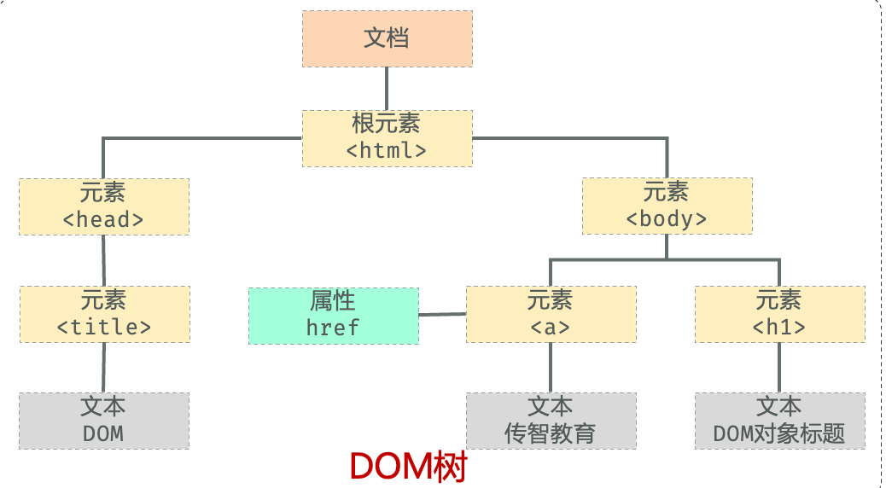
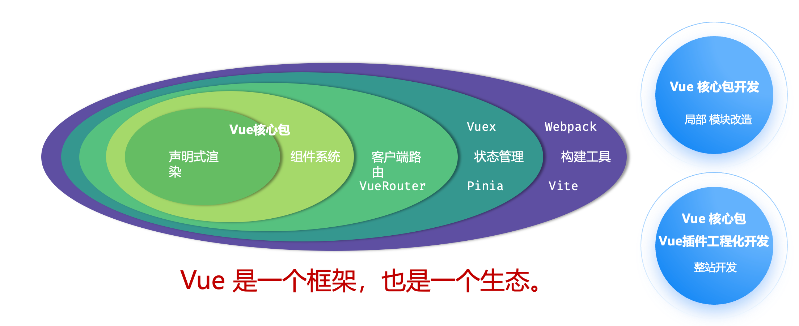
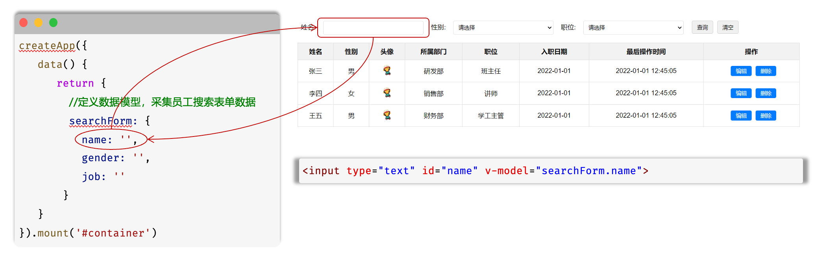
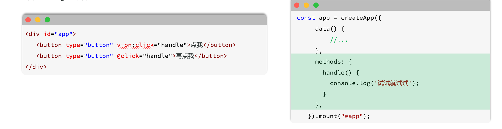
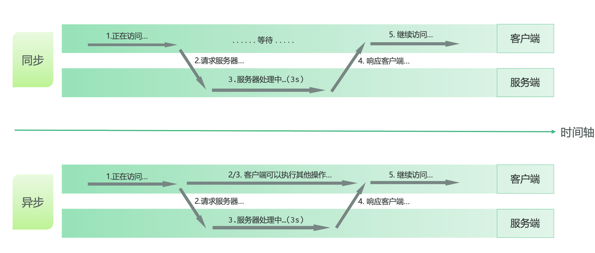
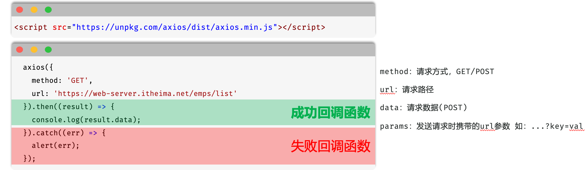
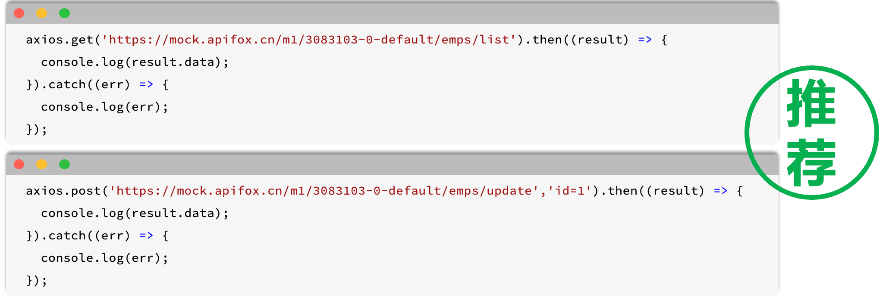
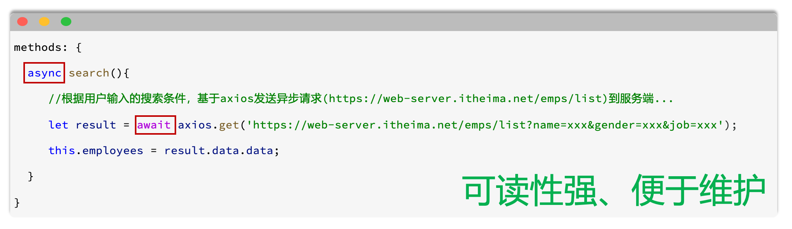

# JavaScript


Javascript（简称：Js）是一门跨平台、<font style="background-color:#FBDE28;">面向对象</font>的脚本语言，是用来控制网页行为，实现页面的交互效果。

Javascript 和 Java 是完全不同的语言，不论是概念还是设计。但是<font style="background-color:#FBDE28;">基础语法类似</font>。

组成：

• ECMAScript： 规定了JS基础语法核心知识，包括变量、数据类型、流程控制、函数、对象等。

• BOM：浏览器对象模型，用于操作浏览器本身，如：页面弹窗、地址栏操作、关闭窗口等。

• DOM：文档对象模型，用于操作HTML文档，如：改变标签内的内容、改变标签内字体样式等。


## JS的引入方式
### 内部脚本：将JS代码定义在HTML页面中
1. JavaScript代码必须位于<script></script> 标签之间
2. 在HTML文档中，可以在<font style="background-color:#FBDE28;">任意地方</font>，放置<font style="background-color:#FBDE28;">任意数量</font>的 <script>
3. 一般会把脚本置于 <body>元素的底部，可改善显示速度，原因如下：

一般会把script标签放在body的底部，因为html标签是从上到下渲染的，放在底部可以先渲染html语句，改善显示速度，同时如果js中有对html里的标签进行操作，标签还没加载出来的话，就会报错


### 外部脚本：将 JS代码定义在外部 JS文件中，然后引入到HTML页面中


## 变量和常量
**JS中用 let 关键字来声明变量（****<font style="background-color:#FBDE28;">弱类型</font>****语言，变量可以****<font style="background-color:#FBDE28;">存放不同类型</font>****的值）**


变量名需要遵循如下规则：


• 只能用 字母、数字、下划线（_）、美元符号（$）组成，且数字不能开头

• 变量名严格区分大小写，如 name 和 Name 是不同的变量

• 不能使用关键字，如：let、var、if、for等


JS中用 const 关键字来声明常量。

一旦声明，常量的值就不能改变（不可以重新赋值）


在早期的js中，声明变量还可以使用var，但是并不严谨（不推荐）


**输出语句：**

1. window.alert（） ：弹出警告框（使用频次较高）
2. console.log（）：写入浏览器控制台（使用频次较高）
3. document.write（）：向HTML的body内输出内容


## 数据类型
JavaScript的数据类型分为：<font style="background-color:#FBDE28;">基本数据类型和引用数据类型</font>（对象）。


基本数据类型：

1. number：数字（整数、小数、NaN（Not a Number））
2. boolean：布尔，true,false
3. null：对象为空，Javascript是大小写敏感的，因此null、NuLL、NULL是完全不同的
4. undefined：当声明的变量未初始化时，该变量的默认值是 undefined
5. string：字符串，单引号、双引号、反引号皆可，推荐使用单引号


<font style="background-color:#FBDE28;">使用 typeof 运算符可以获取数据类型</font>


模板字符串语法：


•``（反引号，英文输入模式下按键盘的tab键上方波浪线~那个键）

• 内容拼接变量时，使用$｛｝包住变量

```java
  <script>
    let name = 'Tom';
    let age = 18;
    console.log('大家好, 我是新入职的' + name + ', 今年' + age + '岁了, 请多多关照');
    console.log(`大家好, 我是新入职的${name}, 今年${age}岁了, 请多多关照`);
  </script>

```

## 函数
介绍：函数（ function ）是被设计用来执行特定任务的代码块，方便程序的封装复用。

定义：JavaScript中的函数通过function关键字进行定义，语法为：

```java
function functionName(参数1, 参数2 ...){
   //要执行的代码
}

```

<font style="background-color:#FBDE28;">由于JS是弱类型语言，形参、返回值都不需要指定类型。在调用函数时，实参个数与形参个数可以不一致，但是建议一致。</font>


### 匿名函数
函数表达式：

```javascript
let add = function(a, b){
  return a + b;
}
```

箭头函数：

```javascript
let add = (a, b) => {
   return a + b;
}
```

匿名函数定义后，可以通过变量名直接调用

```javascript
let result = add(10,20);
alert(result);
```

## 自定义对象
定义格式

```javascript
let 对象名 = {
    属性名1: 属性值1,
    属性名2: 属性值2,
    属性名3: 属性值3,
    方法名: function (形参列表) {}
}
```

例子：

```javascript
let user = {
    name: 'Tom',
    age: 20,
    gender: '男',
    sing: function () {
      alert(this.name+'唱着最炫的民族风')
    }
}
```

里边的方法可以简化成：

```javascript
let user = {
    name: 'Tom',
    age: 20,
    gender: '男',
    sing() {
        alert(this.name+'唱着最炫的民族风')
    }
}
```

**调用格式**

```javascript
对象名.属性名;
对象名.方法名();

console.log(user.name);
user.sing();
```

注意：在定义对象中的方法时，尽量不要使用箭头函数（this），因为在箭头函数里边，this会指向<font style="background-color:#FBDE28;">当前对象的父级对象 </font>

<font style="background-color:#FBDE28;"></font>


## JSON
概念：Javascript Object Notation,Javascript对象标记法（JS对象标记法书写的文本）。


由于其语法简单，层次结构鲜明，现多用于作为<font style="background-color:#FBDE28;">数据载体</font>，在网络中进行<font style="background-color:#FBDE28;">数据传输</font>。

<font style="background-color:#FBDE28;">JSON.parse ：将json字符串转为js对象</font>

<font style="background-color:#FBDE28;">JSON.stringify：将js对象转为json字符串</font>


## DOM
概念：Document Object Model，文档对象模型。


将标记语言的各个组成部分封装对应的对象：

• Document ： 整个文档对象

• Element：元素对象

• Attribute：属性对象

• Text：文本对象

• Comment： 注释对象


JavaScript通过DOM，就<font style="background-color:#FBDE28;">能够对HTML进行操作</font>：

• 改变 HTML 元素的内容

• 改变 HTML 元素的样式（CSS）

• 对 HTML DOM 事件作出反应

• 添加和删除 HTML 元素



### DOM操作
DOM操作核心思根：将网页中所有的元素当做对象来处理。（标签的所有属性在该对象上都可以找到）

<font style="background-color:#FBDE28;">DOM是：文档对象模型，JS提供的专门用来操作网页内容的</font>

操作步骤 

• 获取要操作的DOM元素对象

• 操作DOM对象的属性或方法（查文档或AI）


获取DOM对象

• 根据CSS选择器来获取DOM元素，获取匹配到的第一个元素：document.querySelector('选择器')

  #sid（id选择器） .txt（类选择器）  span（标签选择器）

• 根据CSS选择器来获取DOM元素，获取匹配到的所有元素：document.querySelectorALL（'选择器'）

注意：得到的是一个NodeList节点集合，是一个伪数组（<font style="background-color:#FBDE28;">有长度、有索引的数组</font>）


## 事件监听
事件：HTML事件是发生在HTML元素上的“事情”。比如：

• 按钮被点击

• 鼠标移动到元素上

• 按下键盘按键


事件监听：JavaScript可以在事件触发时，就立即调用一个函数做出响应，也称为<font style="background-color:#FBDE28;">事件绑定</font>或<font style="background-color:#FBDE28;">注册事件</font>。


**语法：事件源.addEventListener（'事件类型'，事件触发执行的函数）；**

事件监听三要素

1. 事件源：哪个dom元素触发了事件，要获取dom元素
2. 事件类型：用什么方式触发，比如：鼠标单击 click
3. 事件触发执行的函数：要做什么事

```javascript
<input id="btn" type="button" value="点我一下试试2">
<script>
  document.querySelector('#btn').addEventListener('click',()=>{
    alert('试试就试试');
  }) 
</script>
```

早期版本写法（了解）：事件源.on事件= function（）｛...｝

```javascript
<input id="btn" type="button" value="点我一下试试2">
<script>
    document.querySelector('#btn').onclick = function () {
      alert('试试就试试');
    }
</script>
```

<font style="background-color:#FBDE28;">区别：on方式会被覆盖，addEventListener方式可以绑定多次，拥有更多特性，推荐使用</font>


<font style="background-color:#FBDE28;">事件源.addEventListener（'事件类型'，要执行的函数）</font>


### 常见事件
**鼠标事件**

click：鼠标点击

mouseenter： 鼠标移入

mouseleave：鼠标移出


**键盘事件**

keydown：键盘按下触发

keyup：键盘抬起触发


**焦点事件**

focus：获得焦点触发

blur：失去焦点触发


**表达事件**

input： 用户输入时触发

submit： 表单提交时触发


## JS优化-模块化设计
```javascript
 <script src="./js/eventDemo.js" type="module"></script>
```

```javascript
import { printLog } from "./utls.js";
//click: 鼠标点击事件
document.querySelector('#b2').addEventListener('click', () => {
    printLog("我被点击了...");
})

//mouseenter: 鼠标移入
document.querySelector('#last').addEventListener('mouseenter', () => {
    printLog("鼠标移入了...");
})
```

```javascript
export function printLog(msg){
    console.log(msg);
}
```

# Vue基础入门
**Vue是一款用于构建用户界面的渐进式的JavaScript框架。**

构建用户界面：把数据变成用户能看得懂的形式进行展示

渐进式：指的是我们使用Vue框架呢，我们不需要把所有的组件、语法全部学习完毕才可以使用Vue。 而是，我们学习一点就可以使用一点了



框架：就是一套完整的项目解决方案，用于快速构建项目。

优点：大大提升前端项目的开发效率。

缺点：需要理解记忆框架的使用规则。（参照官网）


准备


• 引入Vue模块（官方提供）


• 创建Vue程序的应用实例，控制视图的元素


• 准备元素（div），被Vue控制


数据驱动视图


• 准备数据


• 通过插值表达式渲染页面

```javascript
<body>
  <div id = "app">
  用插值表达式来渲染页面
   <h1>{{message}}</h1> 
  </div>

  <script type="module">
  // 相当于引用了一个createApp这个函数，mount指定接管的区域
  // data方法的返回值就是在vue中定义的数据
    import { createApp, ref } from 'https://unpkg.com/vue@3/dist/vue.esm-browser.js';
    createApp({
      data() {
        return {
          message: 'Hello Vue!'
        }
      }
    }).mount('#app')

  </script>
</body>
```

在vs中 []括起来的是数组，{}括起来的是对象

差值表达式不能写在标签的内部


## v-for
作用：列表渲染，遍历容器的元素或者对象的属性

语法：

```javascript
<tr v-for="(item,index) in items" :key="item.id"> {{item}}</tr>
```


参数说明：

• items 为遍历的数组

• item 为遍历出来的元素


• index 为索引/下标，从0开始；可以省略，省略index语法：v-for="item in items

key：


作用：给元素添加的唯一标识，便于vue进行列表项的正确排序复用，提升渲染性能


• 推荐使用id作为key（唯一），不推荐使用index作为key（会变化，不对应）


<font style="background-color:#FBDE28;">遍历的数组，必须在data中定义；要想让哪个标签循环展示多次，就在哪个标签上使用 v-for 指令</font>

<font style="background-color:#FBDE28;"></font>


## v-bind
作用：动态为HTML标签绑定属性值，如设置href，src，style样式等

语法：v-bind：属性名="属性值"

```javascript

```

简化：:属性名="属性值"

```javascript

```

动态的为标签的属性绑定值，<font style="background-color:#FBDE28;">不能使用插值表达式</font>，得使用 v-bind 指令。且绑定的数据，必须在data中定义。


## v-if & v-show
作用：这两个指令都是用来控制元素的显示与隐藏

### v-if


• 语法：v-if="表达式"，表达式值为 true，显示；false，隐藏 作用在标签<span>上


• 原理：基于条件判断，来控制创建或移除元素节点（条件渲染）


• 场景：要么显示，要么不显示，<font style="background-color:#FBDE28;">不频繁切换的场景</font>


• 其它：可以配合 v-else-if / v-else 进行链式调用条件判断


v-else-if必须出现在v-if之后，可以出现多个；v-else 必须出现在v-if/v-else-if之后。


### v-show
• 语法：v-show="表达式"，表达式值为 true，显示；false，隐藏


• 原理：基于CSS样式display来控制显示与隐藏


• 场景：<font style="background-color:#FBDE28;">频繁切换显示隐藏</font>的场景


v-show的表达式不论是真是假，都会渲染出来，但是底层是通过css的样式来控制显示还是隐藏

<font style="background-color:#FBDE28;">vue的指令需要作用在标签中，类似于标签中的属性</font>

<font style="background-color:#FBDE28;"></font>

<font style="background-color:#FBDE28;"></font>

## v-model
作用：在表单元素上使用，双向数据绑定。可以方便的 <font style="background-color:#FBDE28;">获取</font> 或 <font style="background-color:#FBDE28;">设置</font> 表单项数据

语法：v-model="变量名"


v-model 中绑定的变量，必须在data中定义。

双向数据绑定，就是页面和数据模型之间的绑定，数据和页面的展示都会改变





## v-on
作用：为html标签绑定事件（添加事件监听）


语法：


• v-on：事件名="方法名"

• 简写为@事件名=".."

method是与data平级的关系




methods函数中的this指向Vue实例，可以通过this获取到data中定义的数据。


# Ajax
介绍：Asynchronous Javascript And XML，异步的javascript和XML。

作用：

•数据交换：通过Ajax可以**给服务器发送请求**，并**获取服务器响应的数据**。

•异步交互：可以在不重新加载整个页面的情况下，与服务器交换数据并更新部分网页的技术，如：搜索联想、用户名是否可用的校验等等。


XML：（英语：Extensible Markup Language） 可扩展标记语言，本质是一种数据格式，可以用来存储复杂的数据结构。



## Axios
介绍：Axios 对原生的Ajax进行了封装，简化书写，快速开发。

官网：[https://www.axios-http.cn](https://www.axios-http.cnL)

步骤：

• 引入Axios的js文件（参照官网）

• 使用Axios发送请求，并获取响应结果



为了方便起见，Axios已经为所有支持的请求方法提供了别名

格式：axios.请求方式（url ［，data ［， config］］）



## async & await
可以通过async、await可以让异步变为同步操作。async就是来声明一个异步方法，await是用来等待异步任务执行。



await关键字只在async函数内有效，await关键字取代then函数，等待获取到请求成功的结果值。


## Vue的生命周期
生命周期：指一个对象<font style="background-color:#FBDE28;">从创建到销毁</font>的整个过程。


生命周期的八个阶段：每触发一个生命周期事件，会自动执行一个生命周期方法（钩子）。

| **<font style="color:white;">状态</font>** | **<font style="color:white;">阶段周期</font>** |
| :---: | :---: |
| <font style="color:#525b5a;">beforeCreate</font> | <font style="color:#525b5a;">创建前</font> |
| <font style="color:#525b5a;">created</font> | <font style="color:#525b5a;">创建后</font> |
| <font style="color:#525b5a;">beforeMount</font> | <font style="color:#525b5a;">载入前</font> |
| <font style="color:#525b5a;background-color:#FBDE28;">mounted</font> | <font style="color:#525b5a;background-color:#FBDE28;">挂载完成</font> |
| <font style="color:#525b5a;">beforeUpdate</font> | <font style="color:#525b5a;">数据更新前</font> |
| <font style="color:#525b5a;">updated</font> | <font style="color:#525b5a;">数据更新后</font> |
| <font style="color:#525b5a;">beforeUnmount</font> | <font style="color:#525b5a;">组件销毁前</font> |
| <font style="color:#525b5a;">unmounted</font> | <font style="color:#525b5a;">组件销毁后</font> |


```javascript
<script type="module">
   import { createApp } from 'https://.../vue.esm-browser.js'
   const app = createApp({
     data() {
       return {
         message: "Hello Vue"
       }
     },     //生命周期-钩子函数 mounted
     mounted() {
       console.log('Vue挂载完毕, 发送请求获取数据 ...');
     }
   }).mount("#app");
</script>

```


